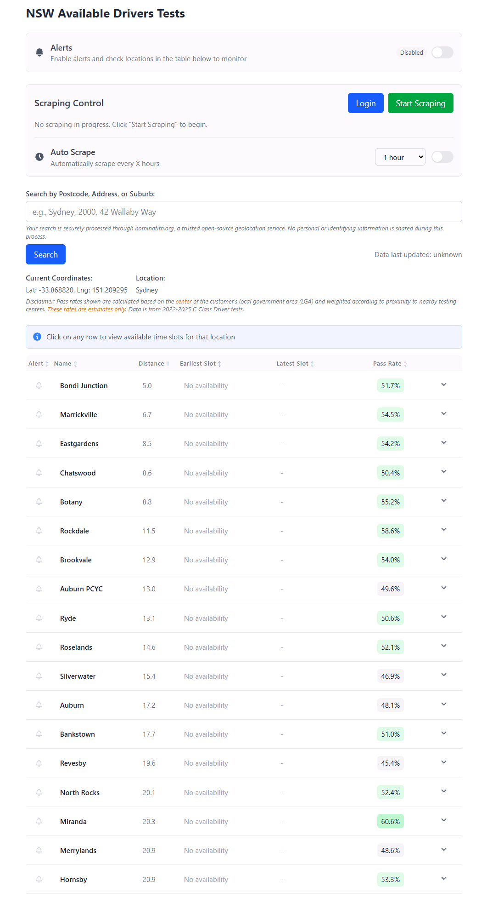

# NSW Drivers Test - Find Available Test Times

### LIVE: [driverstest.noob.place](https://driverstest.noob.place)

A modern, efficient tool for checking driving test availability across Service NSW centers.



## Overview

NSW Drivers Test is a web application that helps learner drivers find the earliest available driving test appointments across all Service NSW locations. Instead of manually checking each location, this tool aggregates availability data and sorts locations by distance from your chosen address/location.

## Technologies Used

- **Rust** - Core application logic with strong safety guarantees
- **Tokio** - Asynchronous runtime for efficient concurrent operations
- **Leptos** - Fast, reactive web framework that compiles to WebAssembly
- **Serde** - Serialization/deserialization framework
- **OpenStreetMap Nominatim API** - Geocoding for location-based searches
- **WebAssembly** - For client-side processing of location data
- **Tailwind CSS** - For responsive, modern UI design

## Features

- **Location Search**: Find Service NSW centers by address, suburb, or postcode
- **Distance Calculation**: View centers ordered by distance from your location
- **Availability Tracking**: See the earliest available test slot for each location
- **Auto Refresh**: Data automatically refreshes to keep information current
- **Privacy-focused**: Location searches processed locally in your browser
- **Responsive Design**: Works on desktop, tablet, and mobile devices
- **No Login Required**: No Service NSW credentials needed to view availability

## Installation

### Prerequisites

- Rust and Cargo (nightly version)
- Node.js and npm
- Chrome browser
- ChromeDriver (matching your Chrome version)

### Quick Setup (Docker)

```bash
# Clone the repository
git clone https://github.com/teehee567/nsw-drivers-test.git
cd nsw-drivers-test

# Create .env file with your MyRTA credentials
cp .envexample .env
# Edit .env with your credentials

# Run with Docker Compose
docker-compose up -d
```

### Manual Setup (Windows)

```powershell
# 1. Install Rust (nightly)
# Download from https://rustup.rs and run installer
rustup default nightly
rustup target add wasm32-unknown-unknown

# 2. Install cargo-leptos
cargo install --locked cargo-leptos

# 3. Install npm dependencies
npm install

# 4. Download ChromeDriver
# Get from https://googlechromelabs.github.io/chrome-for-testing/
# Extract to ./chromedriver-win64/

# 5. Create .env file
# Use MYRTA_USERNAME and MYRTA_PASSWORD (not USERNAME/PASSWORD to avoid Windows conflicts)
echo "MYRTA_USERNAME=your_licence_number" > .env
echo "MYRTA_PASSWORD=your_password" >> .env
```

### Manual Setup (Linux/macOS)

```bash
# 1. Install Rust (nightly)
curl --proto '=https' --tlsv1.2 -sSf https://sh.rustup.rs | sh
rustup default nightly
rustup target add wasm32-unknown-unknown

# 2. Install cargo-leptos
cargo install --locked cargo-leptos

# 3. Install npm dependencies
npm install

# 4. Install ChromeDriver
# Ubuntu/Debian: sudo apt install chromium-chromedriver
# macOS: brew install chromedriver

# 5. Create .env file
cp .envexample .env
# Edit with your MyRTA credentials
```

## Command Line Guide

### Starting the Application

```bash
# Start ChromeDriver (required for scraping)
# Windows:
.\chromedriver-win64\chromedriver.exe --port=57908 --allowed-origins=*

# Linux/macOS:
chromedriver --port=57908 --allowed-origins=*

# In a new terminal, start the web server
cargo leptos serve
# Server runs at http://127.0.0.1:3000
```

### Development Mode (with hot-reload)

```bash
cargo leptos watch
```

### Building for Production

```bash
cargo leptos build --release
```

### Running the Built Binary

```bash
./target/release/nsw-closest-display
```

### Stopping All Processes (Windows PowerShell)

```powershell
Get-Process | Where-Object { $_.ProcessName -like "*nsw-closest*" } | Stop-Process -Force
Get-Process | Where-Object { $_.ProcessName -like "*chromedriver*" } | Stop-Process -Force
```

### Stopping All Processes (Linux/macOS)

```bash
pkill -f nsw-closest
pkill -f chromedriver
```

## Configuration

### settings.yaml Options

```yaml
headless: true                    # Run Chrome in headless mode (false to debug)
username: "${MYRTA_USERNAME}"     # MyRTA username from .env
password: "${MYRTA_PASSWORD}"     # MyRTA password from .env
have_booking: false               # Set true if you already have a booking
selenium_driver_url: "http://localhost:57908"
selenium_element_timout: 20000    # Element wait timeout (ms)
selenium_element_polling: 100     # Polling interval (ms)
retries: 4                        # Number of retry attempts
scrape_refresh_time_min: 120      # Auto-refresh interval (minutes)

# Filter to specific locations (empty = all locations)
locations:
  - "96"    # Ryde
  - "621"   # North Rocks
  # Add more location IDs from data/centres.json

# Date range filter (optional)
date_filter_start: "2026-02-01"
date_filter_end: "2026-09-30"
```

### Finding Location IDs

Location IDs can be found in `data/centres.json`. Common Sydney locations:

| Location | ID |
|----------|-----|
| Auburn | 112 |
| Auburn PCYC | 601 |
| Bankstown | 20 |
| Blacktown | 26 |
| Castle Hill | 35 |
| Chatswood | 37 |
| Hornsby | 63 |
| Liverpool | 74 |
| North Rocks | 621 |
| Parramatta (Silverwater) | 241 |
| Ryde | 96 |

## Usage

1. Visit the application in your browser (default: `http://localhost:3000`)
2. Enter your address, suburb, or postcode in the search box
3. View driving test centers sorted by distance from your location
4. See the earliest available time slot for each center
5. Use the refresh button to get the latest availability data

## Troubleshooting

### "cargo not recognized" (Windows)
Restart your terminal or refresh PATH:
```powershell
$env:Path = [System.Environment]::GetEnvironmentVariable("Path","Machine") + ";" + [System.Environment]::GetEnvironmentVariable("Path","User")
```

### Wrong credentials being used (Windows)
Windows has a system `USERNAME` variable. Use `MYRTA_USERNAME` instead in your `.env` file.

### ChromeDriver version mismatch
Ensure ChromeDriver version matches your Chrome browser version. Check Chrome version at `chrome://version/`

### Scraping fails with "Book test not found"
- Verify your MyRTA credentials are correct
- Set `headless: false` in settings.yaml to watch the browser
- Check if MyRTA requires captcha or 2FA

## Contributing

Contributions are welcome! Please feel free to submit a Pull Request.

## Disclaimer

- Not affiliated with Service NSW or the New South Wales Government

## License

This project is licensed under the GPL3 License - see the LICENSE file for details.

## References
[sbmkvp](https://github.com/sbmkvp/rta_booking_information)
